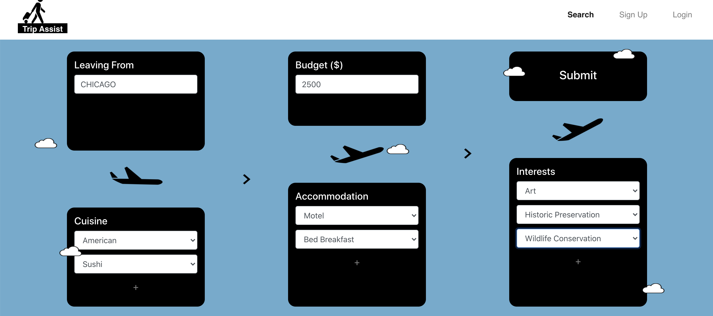
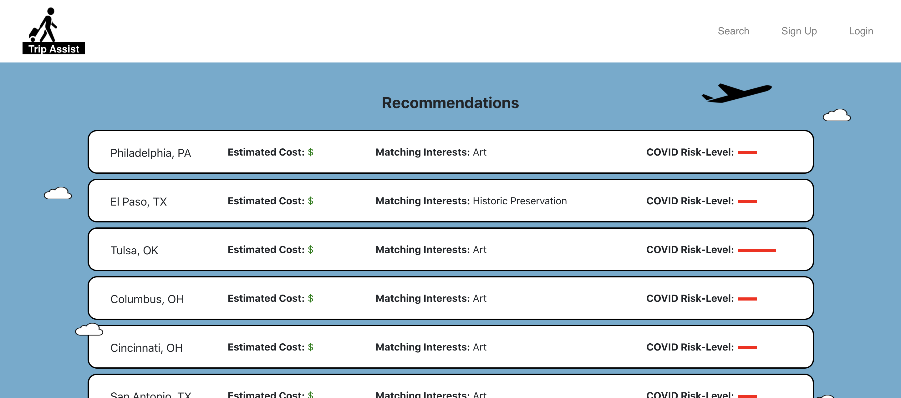
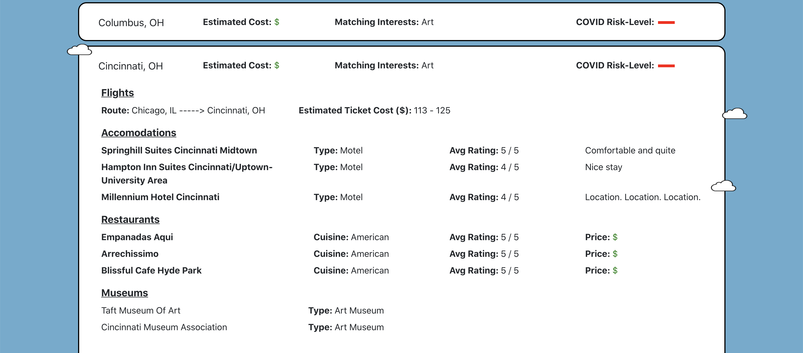
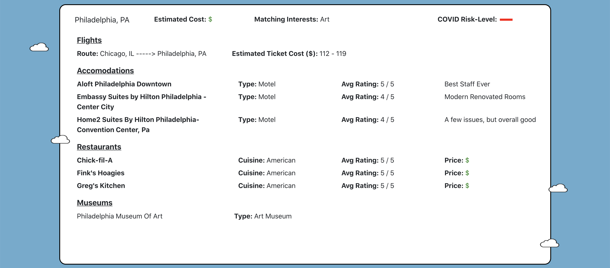
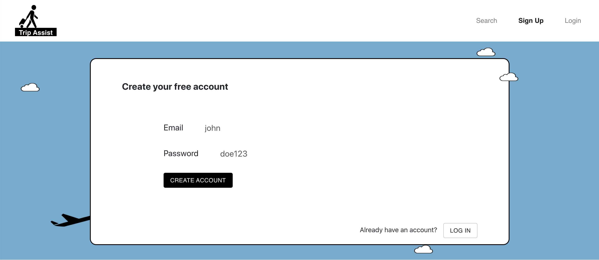
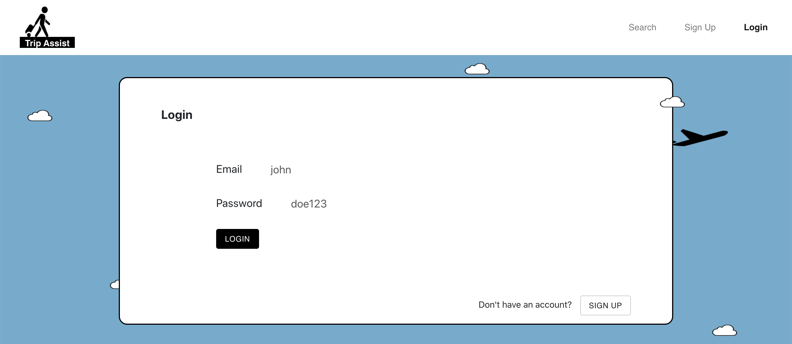
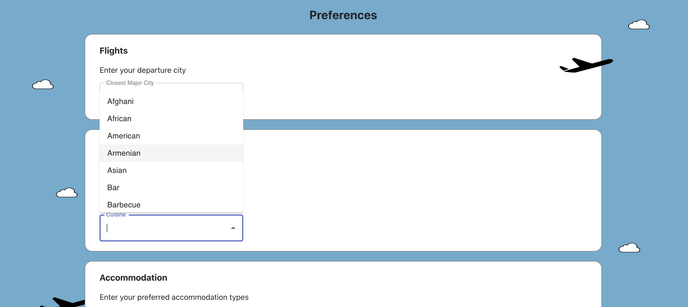
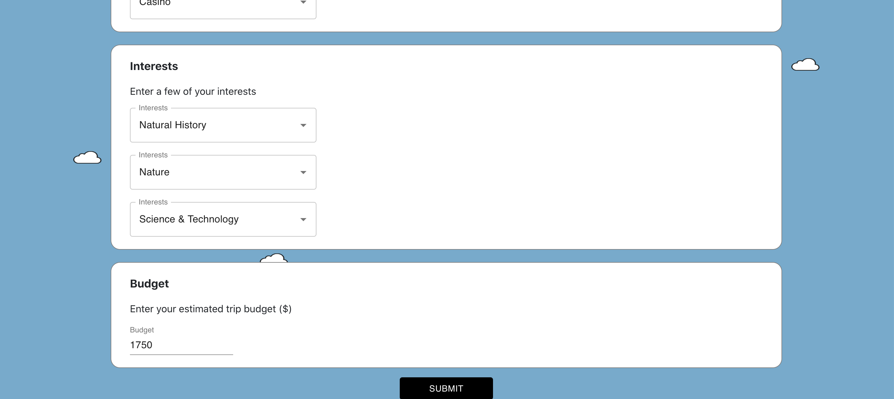

# TripAssist

TripAssist is a React application that recommends cities and museums/restaurants/accommodations based on user preferences. The app takes into account Covid risk in making these recommendations.

## Installation

Clone this repository, then use the below install command in both /client and /server directories to install respective requirements.

```bash
npm install
```

## Usage and Images

Home page 


Search Page


Results Pages




Sign Up Page


Login Page


User Preferences



## Contributing
Pull requests are welcome. Created in fulfillment of UPenn Masters course "Database and Information Systems."

## License
[MIT](https://choosealicense.com/licenses/mit/)
